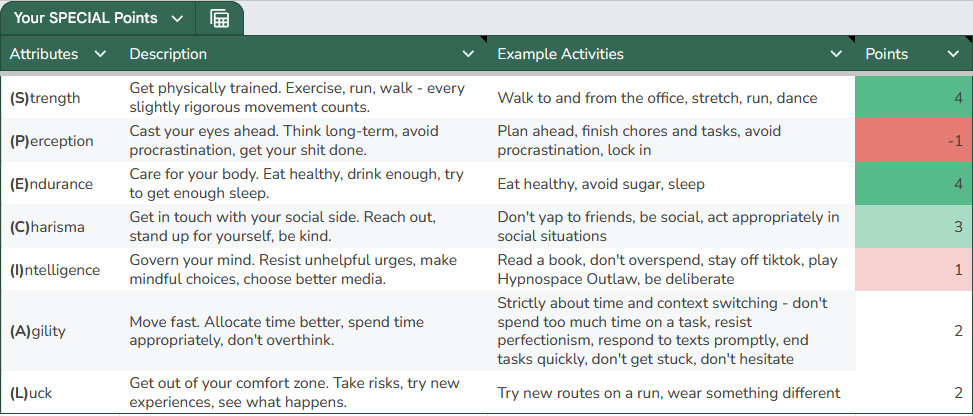
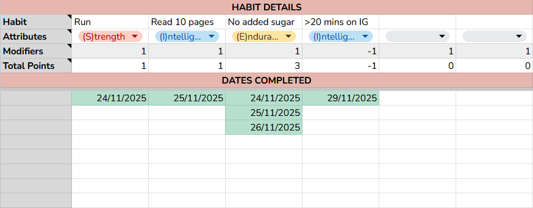

# SPECIAL Tracker
This is a simple, unserious habit tracker and activity log inspired by Fallout's SPECIAL attribute system. Define your own habits and activities to track, make a log every time you complete them, and see how SPECIAL you are.

Made in Google Sheets.

## Links
Use the SPECIAL Tracker here: [LINK](https://docs.google.com/spreadsheets/d/1GQ-ucaqJwEiBsAeKtHdm65tuTnPfpHEsK_2g2yobN2U/edit?usp=sharing).

To start your own tracking, make a copy of the sheet (File → Make a copy).

## How to Use

The SPECIAL Tracker is organized into nine different tabs:

* SPECIAL Dash
* Habit Tracker
* Seven SPECIAL attribute tabs (Strength, Perception, Endurance, Charisma, Intelligence, Agility, Luck)

TL;DR:
* **Habit Tracker** is where you track recurring habits.
* **The SPECIAL attribute tabs** are where you log activities related to each attribute.
* **SPECIAL Dash** is the dashboard where it all comes together into your own SPECIAL skill points.
* Every tab has "notes" for quick explanations.

For more detailed explanations on how to use each tab, read on.

## SPECIAL Dashboard

This is where all the habits you've tracked and all the activities you've logged come together.

The sheet comes with each SPECIAL attribute pre-defined, but you are completely welcome to modify the definitions and activity examples to suit your needs.

These descriptions and examples do not affect your SPECIAL points at all; they are only there for your own reminder of what each one means to you and to help you track your habits better.

The real tracking and logging happens in the next tabs.

## Habit Tracker

This is where you track your recurring habits. Write down the habits to track, its corresponding SPECIAL attribute, the number of points to gain or lose for each date logged, and the log of dates where each habit is completed.

For example, I'm developing a habit of cutting down on added sugar every day **("Habit" row)**. Per my definition, I associate this habit with the Endurance attribute **("Attributes" row)**. I want to gain 1 Endurance point every time I complete this habit, so that number goes in the **"Modifier" row**. I log a date for every time I complete the habit in **Rows 7 and beyond**.

The **Total Points row** calculates the overall points I have gained or lost for each tracked habit.

## Special Attribute Tabs (Strength, Perception, etc.)

These tabs are where you are free to arbitrarily log any activities corresponding to each SPECIAL attribute. By default, you gain 1 point for each logged activity, but feel free to modify this by overwriting the "Point" column. In my example, I use "-1" for the procrastination logs to lose 1 Perception point every time I procrastinate.
